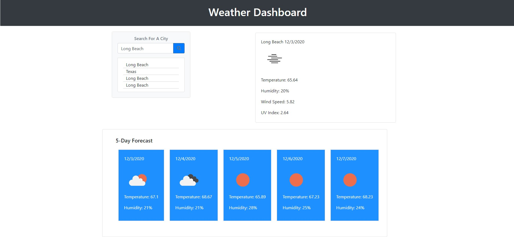

# Loreina Salalila - Weather Dashboard
  
  ## Description
  Developers are often tasked with retrieving data from another application's API and using it in the context of their own. Third-party APIs allow developers to access their data and functionality by making requests with specific parameters to a URL. Your challenge is to build a weather dashboard that will run in the browser and feature dynamically updated HTML and CSS.

  The following link demonstrates the application functionality: [Weather Dashboard](https://vialoraine.github.io/Weather-Dashboard/)

  ## Table of Contents
  * [Usage](#usage)
  * [License](#license)
  * [Contact](#contact)
  * [Screenshots](#screenshots)
  ## Installation
  ## Usage
  ## License
  
  (https://opensource.org/licenses/MIT)
  ## Contact
  Have a question? Email me directly at vialoraine.gg@gmail.com.
  Check out my other projects at [Vialoraine](https://github.com/Vialoraine).
  ## Screenshots
  